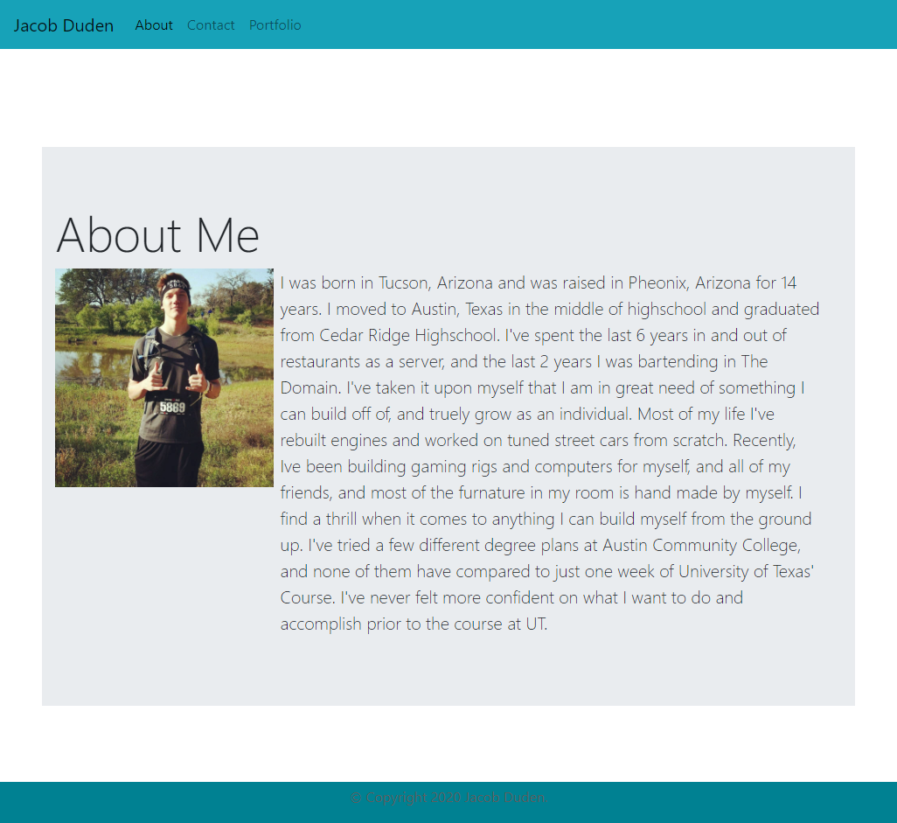

## Jacob Duden's Portfolio

* This portfolio was built using mostly Bootstrap css links and inserts.

* Seperate css style sheets were used to align texts and images to fit properly with screen shrinkage.

* A nav bar is included on the page to navigate to the home page (about me), contact information, and portfolio page.

* All working links to social media are included in the contact information page of the site.

* Portfolio contains placeholder images. Content will be added when I have a content to put in.

## Links

[Deployed Site](https://jacobduden.github.io/Homework2/)

[Repository](https://github.com/jacobduden/Homework2)

## Credit

[Bootstrap](https://getbootstrap.com/)